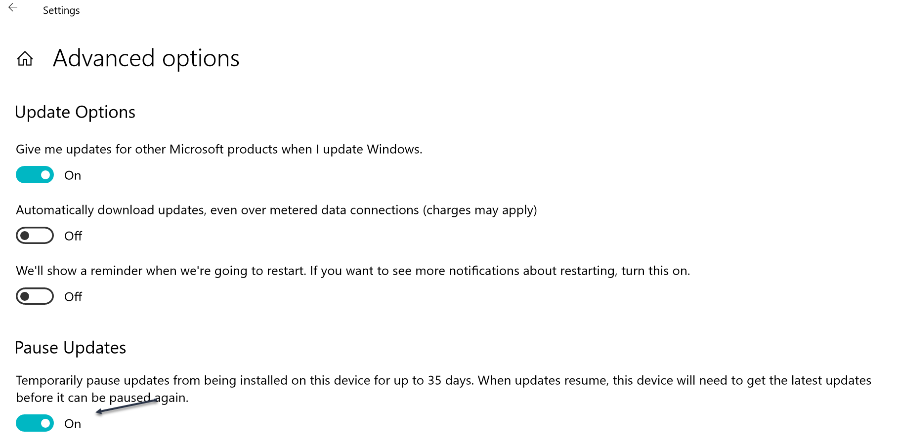

# WindowsUpdateSetting

The PowerShell commands in this module are intended to make it easier to automate the process of pausing and resuming Windows Updates on a Windows 10 desktop.

Normally, you would use Settings to pause Windows Update for 35 days.

You can use this module to toggle that setting from a PowerShell prompt.

 *last updated 9/19/2018*
