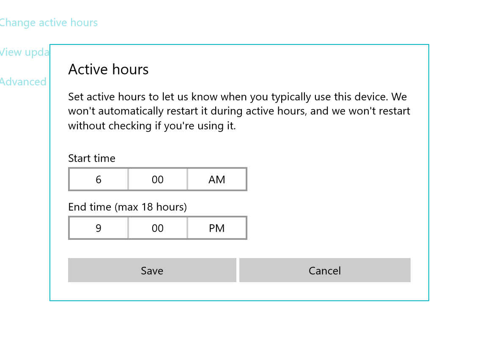
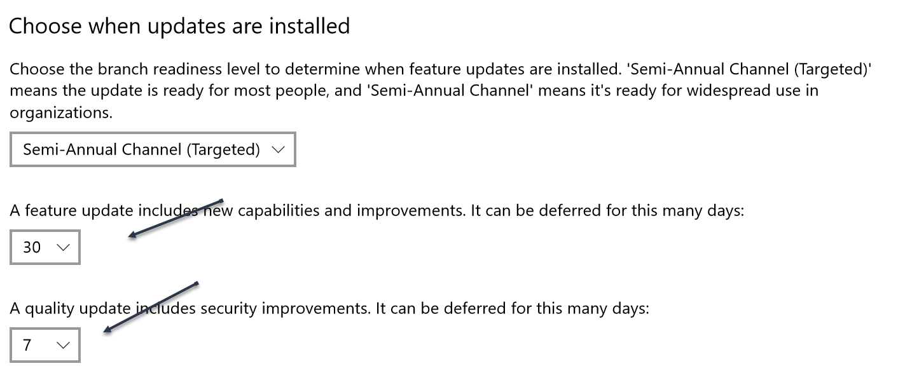

# WindowsUpdateSetting

[](https://www.powershellgallery.com/packages/WindowsUpdateSetting/) [](https://www.powershellgallery.com/packages/WindowsUpdateSetting/)

The PowerShell commands in this module are intended to make it easier to automate the process of pausing and resuming Windows Updates on a Windows 10 desktop as well as a few other update-related settings. This module will not work on Windows 10 Home. If you are running Windows 10 Enterprise, your settings may be managed via Group Policy, in which case you won't be able to use this module.

You can install the latest version of this module from the PowerShell Gallery.

```powershell
Install-Module WindowsUpdateSetting
```

The module should work on PowerShell 7 running on a Windows platform.

## Command Overview

- [Get-WindowsActiveHours](./docs/Get-WindowsActiveHours.md)
- [Get-WindowsUpdateDeferral](./docs/Get-WindowsUpdateDeferral.md)
- [Get-WindowsUpdateSetting](./docs/Get-WindowsUpdateSetting.md)
- [Resume-WindowsUpdate](./docs/Resume-WindowsUpdate.md)
- [Set-WindowsActiveHours](./docs/Set-WindowsActiveHours.md)
- [Set-WindowsUpdateDeferral](./docs/Set-WindowsUpdateDeferral.md)
- [Suspend-WindowsUpdate](./docs/Suspend-WindowsUpdate.md)
- [Test-IsWindowsUpdatePaused](./docs/Test-IsWindowsUpdatePaused.md)

## Suspend and Resume Windows Updates

Normally, you would use Settings to pause Windows Update for 35 days.


You can use this module to toggle that setting from a PowerShell prompt.

```powershell
PS C:\> Suspend-WindowsUpdate -passthru

   Computername: PROSPERO

Paused   PauseStartUTC          PauseEndUTC             TimeRemaining
------   -------------          -----------             -------------
True     8/9/2023 8:27:34 PM    9/13/2023 8:27:34 PM      35.03:59:59
```

Or you can specify a date, as long as it is less than 35 days. Use `Get-WindowsUpdateSetting` to view the current values or `Test-IsWindowsUpdatePaused` to test.

## Configure Active Hours

This module also contains commands to set your active hours.



```powershell
PS C:\> Get-WindowsActiveHours

Computername         Start        End
------------         -----        ---
PROSPERO          06:00 AM   10:00 PM


PS C:\> Set-WindowsActiveHours -StartTime 8:00 -EndTime 20:00 -Passthru

Computername         Start        End
------------         -----        ---
PROSPERO          08:00 AM   08:00 PM
```

## Configure Update Deferral

The module also contains commands to manage deferrals of certain updates.



You can view and modify these settings.

```powershell
PS C:\> Get-WindowsUpdateDeferral

Computername FeatureUpdateDeferral QualityUpdateDeferral
------------ --------------------- ---------------------
BOVINE320                       30                     7


PS C:\> Set-WindowsUpdateDeferral -Feature 0 -Quality 0 -Passthru

Computername FeatureUpdateDeferral QualityUpdateDeferral
------------ --------------------- ---------------------
BOVINE320                       30                     7
```

**You should test all of these commands on a non-production system.**
